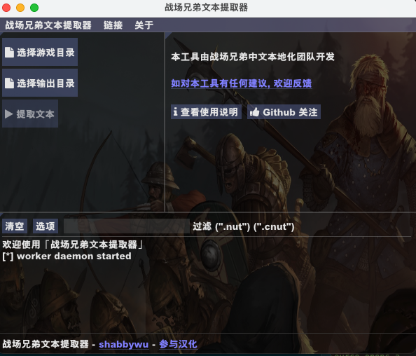

<div align="center">
  🛠
</div>
<h1 align="center">
  战场兄弟文本提取器
</h1>

<p align="center">
    本工具由战场兄弟中文本地化团队开发
</p>
<br/>

# 使用说明
1. 设置游戏数据目录 (通常是 X:\Program Files (x86)\Steam\steamapps\common\Battle Brothers\data 目录)
2. 设置文本提取的输出路径 (例如 X:\Program Files (x86)\Steam\steamapps\common\Battle Brothers\localization\)
3. 点击「提取文本」



# 导出结果说明
文本使用 json 格式的存储导出结果, 每个词条为一个 JSON 对象, 具体字段含义如下:
  * key: 唯一键, 等同于 po format 的 msgid
  * original: 原文
  * translation: 译文
  * context: 原文在游戏代码中的上下文

## 1. 无上下文的简单文本
```json
{

    "key": "Encountered another caravan slaughtered by greenskins",
    "original": "Encountered another caravan slaughtered by greenskins",
    "translation": "",
    "context": ""
}
```

## 2. 具有简单上下文的文本
```json
{
    "key": "Trading Caravan",
    "original": "Trading Caravan",
    "translation": "",
    "context": "this.m.Name = \"Trading Caravan\""
}
```

## 3. 具有复杂上下文的文本
```json
{
    "key": " points",
    "original": " points",
    "translation": "",
    "context": "this.Const.UI.getColorizedEntityName(actor) + \" heals for \" + healthAdded + \" points\""
}
```

# 使用案例
- [Battle Brothers(战场兄弟)中文翻译项目](https://github.com/shabbywu/Battle-Brothers-CN)

[📢如遇到使用问题, 欢迎反馈!](https://github.com/shabbywu/bb-text-extractor/issues)
